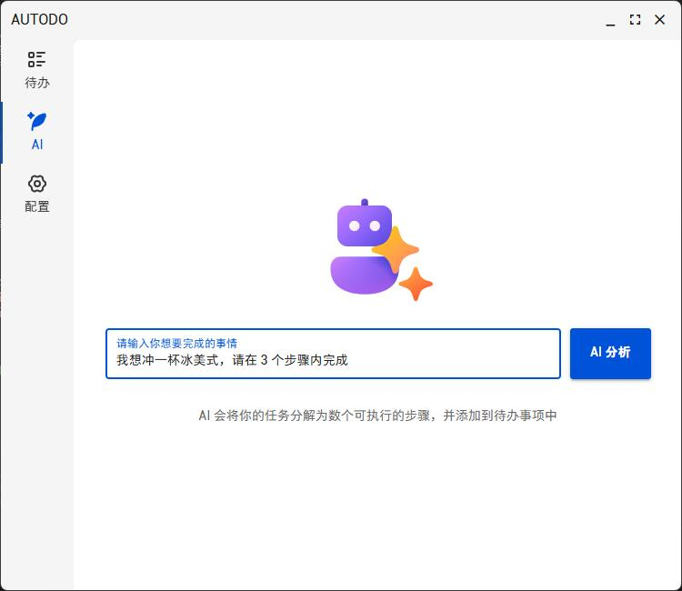
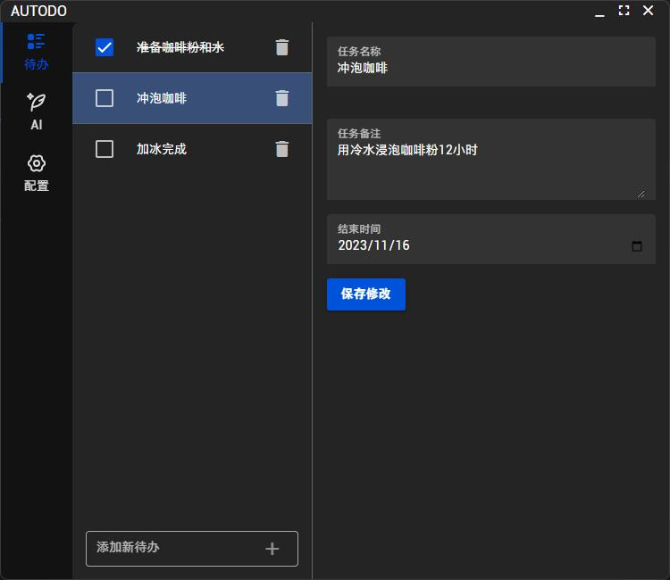

# AUTODO

[](https://github.com/penguin-reactor/autodo)
[](LICENSE)
[](https://electronjs.org)
[](https://vuejs.org)

个人练习小项目。

AUTODO 是一款基于 Electron 和 Vue 的跨平台桌面待办事项应用。

## ✨ 功能特性

- 📝 创建、编辑和删除待办事项
- ✅ 标记任务完成状态
- 🗂️ 任务分类管理
- 🎨 亮色/暗色主题切换

## 🖼️ 应用截图





## 🚀 快速开始

### 环境要求
- Node.js v18+
- pnpm v8+

### 安装依赖
```bash
$ pnpm install
```

### 开发模式
```bash
$ pnpm dev
```

### 构建应用
```bash
# Windows
$ pnpm build:win

# macOS
$ pnpm build:mac

# Linux
$ pnpm build:linux
```

## 📄 许可证

本项目采用 [MIT 许可证](LICENSE) © 2025 企鹅反应堆

## 📬 联系反馈

- 问题追踪: [https://github.com/penguin-reactor/autodo/issues](https://github.com/penguin-reactor/autodo/issues)
- 项目仓库: [https://github.com/penguin-reactor/autodo](https://github.com/penguin-reactor/autodo)
